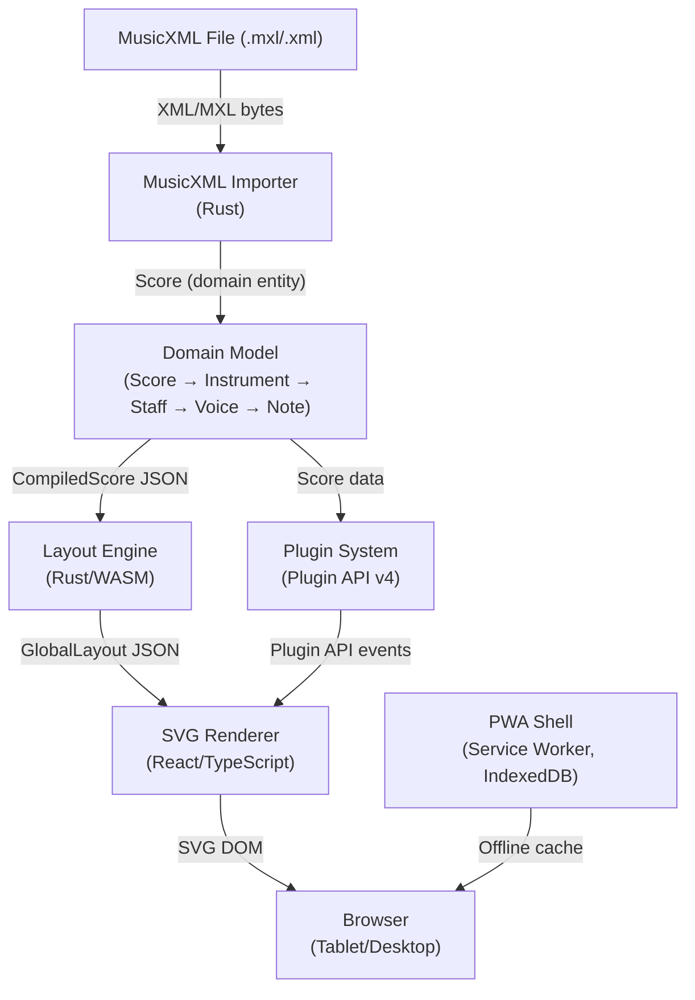

# 🎵 Graditone

**🚀 Live App**: [https://graditone.com/](https://graditone.com/)

A tablet-first **practice app** for interactive music scores — play along, loop sections, and train your sight-reading. Works on desktops, laptops, tablets, and mobile phones.

[](https://www.rust-lang.org/)
[](https://www.typescriptlang.org/)
[](https://react.dev/)
[](https://webassembly.org/)

---

## Overview

Graditone is a tablet-first Progressive Web Application for **music practice with interactive scores**. Load any MusicXML score, follow the highlighted notes during playback, loop difficult passages, and use the built-in practice tools to improve. Built with a Rust music engine compiled to WebAssembly, it implements a hierarchical domain model with precise timing (960 PPQ) and comprehensive validation. Delivers an offline-capable, cross-device experience following constitutional principles of domain-driven design, hexagonal architecture, and test-first practices.

**For a quick feature overview**, see [FEATURES.md](FEATURES.md). For detailed architecture, see [docs/architecture.md](docs/architecture.md).

## Architecture



> For detailed subsystem diagrams, see [docs/architecture.md](docs/architecture.md).

## Feature Highlights

- � **Practice View** ⭐ — The core experience: follow along with highlighted notes, set loop regions over difficult passages, control tempo, and use practice plugins (training mode, virtual keyboard). See [FEATURES.md](FEATURES.md)
- 🎼 **Score Display** — High-fidelity staff notation with SMuFL font (Bravura), ledger lines, beams, ties, slurs
- ▶️ **Playback** — Web Audio API playback with auto-scroll, tempo control, and loop practice regions
- 🎹 **Virtual Keyboard** — On-screen piano keyboard for note visualization. See [PLUGINS.md](PLUGINS.md)
- 📱 **Progressive Web App** — Offline-first, installable on any device, auto-updates on refresh
- 🎵 **MusicXML Import** — Drag-and-drop .mxl/.xml import with error recovery and voice splitting
- ⚡ **WASM Layout Engine** — 120 KB Rust engine computes all layout geometry at 60fps
- 🔌 **Plugin System** — Extensible Plugin API v4 for practice tools and custom views. See [PLUGINS.md](PLUGINS.md)

### Play and Practice View Gestures

| Gesture | Action |
|---|---|
| **Tap** a note | Seek playback to that note and highlight it |
| **Long-press** a note | Pin the note (green highlight) — sets the loop start point |
| **Long-press** a second note | Define a loop region between the two pinned notes (green overlay) |
| **Tap inside** the loop region | Clear the loop and return to free playback |

### Features

✅ **Domain Model**
- Hierarchical score structure: Score → Instrument → Staff → Voice → Note
- Global structural events: Tempo, Time Signature
- Staff-scoped structural events: Clef, Key Signature
- Multi-staff instruments (e.g., piano with treble and bass clefs)
- Polyphonic voices with overlap validation
- 960 PPQ (Pulses Per Quarter note) precision

✅ **Staff Notation View** (Frontend)
- Five-line staff rendering with SMuFL music font (Bravura)
- Accurate pitch-to-position mapping for treble and bass clefs
- Proportional spacing based on MIDI ticks
- Interactive note selection (click to highlight)
- Virtual scrolling for long scores (1000+ notes at 60fps)
- Responsive viewport with auto-resizing
- Ledger lines for notes outside staff range
- Barlines at measure boundaries

✅ **Progressive Web App (PWA)**
- **Offline-first** - Works without internet connection
- **Installable** - Add to home screen on tablets (iPad, Android)
- **Service Worker** - Background caching and updates
- **Local Storage** - IndexedDB for offline score persistence
- **Desktop-class** - Standalone app experience
- **Auto-updates** - Seamless PWA updates on reload
- **Cross-platform** - iOS Safari, Chrome, Edge support
- **WASM-powered** - Rust music engine runs in browser

✅ **REST API** (Backend - Legacy)
- 13 endpoints for complete score management
- Axum web framework with Tokio async runtime
- Thread-safe in-memory repository
- Error handling with proper HTTP status codes
- CORS and tracing middleware

✅ **Rust Layout Engine** (New - Feature 016)
- **High-performance WASM module**: 120 KB gzipped (60% under 300 KB target)
- **Compact JSON output**: 36 KB for 100-measure score (93% under 500 KB target)
- **Glyph batching optimization**: 6.25% runs-to-glyphs ratio (37.5% better than target)
- **Complete layout pipeline**: System breaking, horizontal spacing, vertical positioning
- **Multi-staff support**: Automatic staff grouping for piano and other multi-staff instruments
- **Frontend utilities**: Hit testing, viewport optimization, binary search for tick lookup
- **Full test coverage**: 26 backend tests + 47 frontend utility tests (100% passing)
- **Production-ready**: Comprehensive documentation, no clippy warnings, formatted code

✅ **Layout-Driven SVG Renderer** (New - Feature 017)
- **60fps scrolling performance**: <16ms frame time for 100-measure scores (40 systems)
- **Binary search viewport queries**: <1ms to find visible systems
- **DOM virtualization**: Only renders visible systems (~350 DOM nodes per viewport)
- **Resolution-independent rendering**: SVG-based for crisp display on all devices
- **Interactive components**: ScoreViewer with scroll/zoom (25%-400%), ErrorBoundary for error handling
- **Dark mode support**: Customizable colors via RenderConfig
- **Comprehensive testing**: 168 tests passing (158 active, 10 skipped)
- **Production-ready**: [Quick Start Guide](specs/017-layout-renderer/quickstart.md) and [Validation Report](specs/017-layout-renderer/VALIDATION.md)

✅ **React Frontend**
- TypeScript with strict type checking
- Component-based UI (ScoreViewer, InstrumentList, NoteDisplay, StaffNotation)
- Real-time API integration
- Note display with MIDI pitch and note names
- Complete CRUD operations for scores, instruments, and notes
- Layout utilities for glyph hit testing and viewport optimization

✅ **Testing**
- 837 tests passing (621 integration + 97 layout utilities + 104 component + 15 performance)
- 100% pass rate for implemented features
- Test-first development approach

## Quick Start

### Use the Live App

**🚀 [Launch Graditone](https://graditone.com/)**

- Works on tablets (iPad, Surface, Android), desktops, laptops, and mobile phones
- No installation required — runs in any modern browser
- Offline-capable after first visit
- Add to home screen for app-like experience

> **Platform note**: MIDI input is not available on iOS Safari due to browser limitations. All other features work across all platforms.

### Updates

Graditone is delivered as a Progressive Web App (PWA). To get the latest version, simply **refresh the app** in your browser. There are no app store downloads — updates are deployed directly to [graditone.com](https://graditone.com/) and cached automatically by the Service Worker.

### Local Development

**Prerequisites:**
- Node.js 20.19+ ([install](https://nodejs.org/))
- Rust 1.93+ for WASM compilation ([install](https://rustup.rs/))

**Build and Run:**
```bash
cd frontend
npm install
npm run dev
# Runs on http://localhost:5173
```

**Enable Git hooks** (one-time, run from repo root):
```bash
git config core.hooksPath .githooks
```
This wires up the pre-commit (type-check + lint) and pre-push (Rust tests + build + unit tests + E2E) hooks stored in [`.githooks/`](.githooks/).

**Build WASM Module:**
```bash
cd backend
wasm-pack build --target web
```

## Usage

**For Users**: See [FEATURES.md](FEATURES.md) for feature overview and usage guide.

**For Developers**: The app uses component-based architecture with React + TypeScript. Key components:
- `ScoreViewer` - Main score display with playback controls
- `StaffNotation` - Five-line staff rendering with SMuFL font
- `InstrumentList` - Hierarchical score structure display
- `MusicXMLImportService` - WASM-powered MusicXML parsing

See [frontend/README.md](frontend/README.md) for development documentation.

## Project Structure

```
graditone/
├── backend/                # Rust music engine (WASM)
│   ├── src/
│   │   ├── domain/         # Core domain logic (DDD)
│   │   ├── layout/         # Layout engine (NEW - Feature 016)
│   │   │   ├── mod.rs      # Main layout computation
│   │   │   ├── types.rs    # Layout data structures
│   │   │   ├── spacer.rs   # Horizontal spacing
│   │   │   ├── breaker.rs  # System breaking
│   │   │   ├── positioner.rs # Vertical positioning
│   │   │   ├── batcher.rs  # Glyph batching
│   │   │   └── wasm.rs     # WASM bindings
│   │   ├── wasm/           # WASM bindings
│   │   └── lib.rs          # Library entry point
│   ├── benches/            # Performance benchmarks
│   ├── pkg/                # Generated WASM output
│   └── Cargo.toml          # Rust dependencies
├── frontend/               # React PWA
│   ├── src/
│   │   ├── components/     # React components
│   │   │   ├── LayoutRenderer.tsx # SVG renderer (NEW - Feature 017)
│   │   │   └── ErrorBoundary.tsx  # Error handling (NEW - Feature 017)
│   │   ├── pages/          # Page components
│   │   │   ├── ScoreViewer.tsx    # Interactive viewer (NEW - Feature 017)
│   │   ├── services/       # WASM integration, storage
│   │   ├── types/          # TypeScript types
│   │   ├── utils/          # Layout utilities (Feature 016 & 017)
│   │   │   ├── layoutUtils.ts  # Hit testing, viewport optimization (016)
│   │   │   └── renderUtils.ts  # Rendering utilities (NEW - Feature 017)
│   │   └── App.tsx         # Main app
│   ├── public/
│   │   ├── wasm/           # WASM module files
│   │   └── icons/          # PWA icons
│   ├── vite.config.ts      # PWA & build config
│   └── package.json        # Dependencies
├── specs/                  # Feature specifications
│   ├── 016-rust-layout-engine/ # Layout engine spec
│   │   ├── plan.md         # Architecture & design
│   │   ├── tasks.md        # 108-task implementation roadmap
│   │   ├── contracts/      # TypeScript interfaces
│   │   └── data-model.md   # Layout data structures
│   ├── 017-layout-renderer/    # SVG renderer spec (NEW)
│   │   ├── plan.md         # Architecture & design
│   │   ├── tasks.md        # 74-task implementation roadmap
│   │   ├── quickstart.md   # Integration guide
│   │   ├── VALIDATION.md   # Test results & validation
│   │   └── checklists/     # Quality checklists
├── .specify/               # Project constitution & memory
└── README.md               # This file
```

## Android Distribution

Graditone is available as an Android app on the Google Play Store, packaged as a [Trusted Web Activity (TWA)](https://developer.chrome.com/docs/android/trusted-web-activity) wrapping the existing PWA.

<!-- Play Store badge — update href once app is live -->
_Google Play listing coming soon._

### Minimum Requirements

- Android 9.0 (Pie, API 28) or later

### Update Process

Android app updates are delivered automatically through Google Play. When a new version is published, installed users receive an update notification. The release process is documented in [android/RELEASE.md](android/RELEASE.md).

---

## Technology Stack

| Layer | Technology | Version |
|-------|-----------|---------|
| Frontend | React + TypeScript | 19 / 5.9 |
| Build Tool | Vite | 7.0 |
| Music Engine | Rust + WASM | 1.93 |
| WASM Tooling | wasm-pack | Latest |
| Storage| IndexedDB | Native |
| PWA | Service Worker | Native |
| Testing | Vitest | 4.0 |

## Constitutional Principles

This project follows seven core principles:

1. ✅ **Domain-Driven Design** — Ubiquitous language, aggregate roots, bounded contexts
2. ✅ **Hexagonal Architecture** — Domain independent of infrastructure
3. ✅ **PWA Architecture** — Offline-first, installable, WASM deployment
4. ✅ **Precision & Fidelity** — 960 PPQ integer arithmetic
5. ✅ **Test-First Development** — TDD workflow, comprehensive test suites
6. ✅ **Layout Engine Authority** — Rust/WASM is the sole authority for spatial geometry
7. ✅ **Regression Prevention** — Every bug fix requires a failing test before the fix

## Documentation

- **Features**: [FEATURES.md](FEATURES.md)
- **Plugins**: [PLUGINS.md](PLUGINS.md)
- **Architecture**: [docs/architecture.md](docs/architecture.md) — system overview with Mermaid diagrams
  - [Frontend PWA](docs/frontend-pwa.md) | [Rust/WASM Engine](docs/wasm-engine.md) | [Layout Engine](docs/layout-engine.md)
  - [SVG Renderer](docs/svg-renderer.md) | [Plugin System](docs/plugin-system.md) | [MusicXML Importer](docs/musicxml-importer.md)
- **Backend**: [backend/README.md](backend/README.md)
- **Frontend**: [frontend/README.md](frontend/README.md)
- **Constitution**: [.specify/memory/constitution.md](.specify/memory/constitution.md)
- **Feature Specifications**: [specs/](specs/)
- **Documentation Update Checklist**: [docs/doc-update-checklist.md](docs/doc-update-checklist.md)
- **Local Validation**: [docs/LOCAL-VALIDATION.md](docs/LOCAL-VALIDATION.md)

## Contributing

All changes must:
- Include tests (unit and/or integration)
- Pass `npm test` (frontend tests)
- Pass `npm run tsc` and `npm run lint` (TypeScript & ESLint)
- Follow domain-driven design principles
- Maintain PWA offline-first architecture
- Update relevant documentation and specs

## License

See repository root for license information.

---

**Version**: [1.0](https://github.com/graditone/graditone)  
**Last Updated**: 2026-02-12  
**Status**: ✅ PWA deployed to GitHub Pages | Layout Engine Complete  
**Test Coverage**: 669 tests (589 integration + 47 layout utilities + 33 component) - 100% passing
