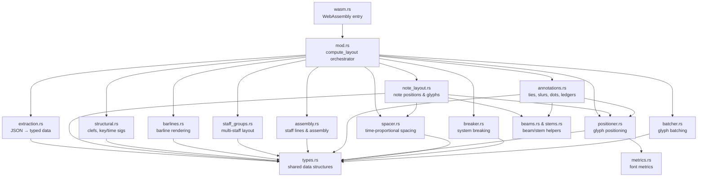

# Layout Engine Architecture

This directory contains the Rust-based music engraving layout engine for Musicore. It implements traditional music notation layout algorithms following SMuFL (Standard Music Font Layout) conventions and engraving best practices.

## Overview

The layout engine transforms semantic musical data (notes, rests, clefs, etc.) into precisely positioned glyphs ready for rendering. It operates in several phases:

1. **Spacing** - Compute time-proportional note spacing
2. **System Breaking** - Decide where to break music across systems/pages
3. **Positioning** - Calculate absolute (x,y) coordinates for each glyph
4. **Batching** - Group glyphs for efficient rendering

## Architecture Diagram



## Module Responsibilities

### `mod.rs` - Layout Orchestrator
**Entry Point**: `compute_layout(score, config) -> GlobalLayout`

Thin orchestration layer that delegates to focused sub-modules. Coordinates the full layout pipeline: extraction → spacing → system breaking → note positioning → structural glyphs → barlines → annotations → assembly. All domain logic has been extracted into the modules listed below.

### `extraction.rs` - Data Extraction
Converts raw JSON score data into typed internal representations (`InstrumentData`, `StaffData`, `VoiceData`, `NoteEvent`, `RestLayoutEvent`). Contains tick-to-measure conversion helpers and the primary `extract_measures` / `extract_instruments` functions.

### `note_layout.rs` - Note & Glyph Positioning
Computes unified horizontal positions for notes across all staves (`compute_unified_note_positions`), generates positioned glyphs — noteheads, accidentals, dots, stems, beams, flags — for each staff (`position_glyphs_for_staff`), and calculates vertical note extents (`compute_staff_note_extents`).

### `barlines.rs` - Barline Rendering
Creates barlines at measure boundaries, generates barline segment geometry (single, double, final, repeat), computes repeat-dot positions, and handles system-end and multi-staff barline joining.

### `structural.rs` - Structural Glyphs
Positions clef, key-signature, and time-signature glyphs at system starts and handles mid-system clef and key-signature changes.

### `staff_groups.rs` - Multi-Staff Layout
Manages inter-staff collision detection, vertical spacing adjustments, bracket/brace glyph generation, and staff-group assembly for multi-instrument and grand-staff layouts.

### `assembly.rs` - Staff Lines & System Assembly
Creates the five staff lines for each staff, renders measure-number annotations and volta brackets, and expands system bounding boxes to accommodate stems, beams, and other overhanging elements.

### `annotations.rs` - Annotation Rendering
Handles augmentation and staccato dots, tie arcs (same-system and cross-system), slur arcs, and ledger-line generation. Returns a consolidated `AnnotationResult` consumed by the orchestrator.

### `spacer.rs` - Time-Proportional Spacing
Computes horizontal spacing for notes based on duration using logarithmic-like scaling.

**Algorithm**:
```
spacing = base_spacing + (duration_ticks / 960) * duration_factor
spacing = max(spacing, minimum_spacing)
```

**Configuration** (`SpacingConfig`):
- `base_spacing`: 30.0 units (minimum distance between notes)
- `duration_factor`: 50.0 (time-proportional multiplier)
- `minimum_spacing`: 30.0 (collision prevention)

**Results** (typical):
- Sixteenth note: ~30 units (1.5 staff spaces)
- Eighth note: ~55 units (2.75 staff spaces)
- Quarter note: ~80 units (4 staff spaces)
- Half note: ~130 units (6.5 staff spaces)
- Whole note: ~230 units (11.5 staff spaces)

**Measure Width**:
Includes note spacing + flag padding (10 units per flagged note) + structural padding (50 units).

### `breaker.rs` - System Breaking
Decides where to break music across systems (lines) and pages.

**Algorithm**:
- Greedy: Pack measures until reaching `max_system_width`
- Scales measure widths proportionally to fill available space
- Handles multi-staff alignment (all staves break at same measures)

**Types**:
- `MeasureInfo` - Width, tick range for each measure
- `TickRange` - Start/end ticks for a system

### `positioner.rs` - Glyph Positioning
Calculates absolute (x, y) coordinates for every glyph.

**Coordinate System**:
- Origin: Top-left of layout
- Units: Logical units (1 staff space = 20 units)
- Y-axis: Downward (larger Y = lower on page)

**Pitch to Y Mapping**:
Uses `pitch_to_y()` function:
```
y = staff_origin + (staff_spaces_from_middle * units_per_space)
```

Middle line (B4 for treble, D3 for bass) = `y_offset` parameter.

**SMuFL Combined Glyphs** (Phase 7):
Uses single glyphs that include stems/flags:
- U+E0A2: `noteheadWhole` (≥3840 ticks)
- U+E1D3: `noteheadHalfWithStem` (1920-3839 ticks)
- U+E1D5: `noteheadBlackWithStem` (960-1919 ticks)
- U+E1D7: `noteEighthUp` (480-959 ticks)
- U+E1D9: `noteSixteenthUp` (<480 ticks)

**Clefs**:
- U+E050: `gClef` (treble, 110px left offset)
- U+E062: `fClef` (bass, 110px left offset)
- U+E05C: `cClef` (alto/tenor, 70px left offset)

**Font Size**: 80pt (SMuFL standard: 1em = 4 staff spaces)

**Note Positioning**:
1. Compute note spacing (from `spacer`)
2. Apply scale factor to fit system width
3. Calculate X: `left_margin + scaled_position`
4. Calculate Y: `pitch_to_y(midi_pitch, clef_type)`

**Barline Positioning** (Phase 7 fix):
Uses note position map for consistent scaling:
```rust
let barline_x = note_positions
    .iter()
    .filter(|(tick, _)| **tick >= measure.start_tick && **tick < measure.end_tick)
    .max_by_key(|(tick, _)| *tick)
    .map(|(_, x)| *x + 30.0) // Clearance for notehead width
    .unwrap_or(left_margin + 30.0);
```

**End Clearance**: 30 units added after last note (20 for notehead width + 10 for spacing).

### `batcher.rs` - Glyph Batching
Groups glyphs into `GlyphRun` batches for efficient rendering.

**Batching Strategy**:
- Group consecutive glyphs with identical font/size/color
- Reduces render calls from N glyphs to M batches (M << N)
- Typical reduction: 80-90% fewer draw calls

**GlyphRun** contains:
- `font_family`, `font_size`, `color` (shared properties)
- `glyphs`: Vector of positioned glyphs

### `types.rs` - Data Structures
Core types for layout representation:
- `GlobalLayout` - Top-level output
- `System` - One line of music
- `StaffGroup` - Instrument group (e.g., piano treble+bass)
- `Staff` - Single 5-line staff
- `Glyph` - Positioned SMuFL character
- `GlyphRun` - Batch of glyphs
- `BarLine` - Measure separator

### `beams.rs` & `stems.rs` - Future Work
**Status**: Currently disabled (Phase 7 uses combined notehead+stem glyphs)

These modules contain beam/stem generation logic for future enhancement:
- Custom stem direction (currently always up via combined glyphs)
- Beam grouping for eighth/sixteenth consecutive notes
- Cross-staff beaming for piano

**TODO**: Restore when implementing Phase 10 (Advanced Notation)

### `wasm.rs` - WebAssembly Interface
Exports `layout_generate()` for JavaScript via wasm-bindgen:
```rust
#[wasm_bindgen]
pub fn layout_generate(score_json: &str) -> Result<String, String>
```

Input: Score JSON (from MusicXML importer)
Output: GlobalLayout JSON (for frontend renderer)

### `metrics.rs` - Layout Metrics
Font metrics and measurement utilities:
- SMuFL bounding boxes
- Staff line thickness
- Standard spacing values

## Coordinate System

### Logical Units
- 1 staff space = 20 logical units
- 1 staff (5 lines) = 80 units height
- Font size: 80pt = 4 staff spaces = 1em (SMuFL standard)

### Staff Positioning
- First staff: `y_offset = 100` units
- Multi-staff separation: 400 units (20 staff spaces for grand staff)
- System spacing: 200 units between systems

### Horizontal Layout
- `max_system_width`: 1600 units (default)
- `left_margin`: 40 units
- `right_padding`: 50 units minimum

## Configuration

### `LayoutConfig`
```rust
pub struct LayoutConfig {
    pub max_system_width: f32,   // 1600.0 (default)
    pub units_per_space: f32,     // 20.0  (SMuFL standard)
    pub system_spacing: f32,      // 200.0 (vertical gap between systems)
    pub system_height: f32,       // 600.0 (for grand staff)
}
```

### `SpacingConfig`
```rust
pub struct SpacingConfig {
    pub base_spacing: f32,       // 30.0 (minimum gap)
    pub duration_factor: f32,    // 50.0 (time proportionality)
    pub minimum_spacing: f32,    // 30.0 (collision prevention)
}
```

## Engraving Principles

### Time-Proportional Spacing
Note spacing reflects duration proportionally (not linearly), following traditional engraving:
- Longer notes get more space
- Maintains visual rhythm
- Measure-level adjustments for flags (not per-note)

### Barline Alignment
Barlines positioned using note position map (consistent scaling):
- Uses same scale factor as notes
- Positioned after last note in measure
- 30 units clearance for notehead width

### Measure Boundaries
Exclusive end ticks: `[start_tick, end_tick)` 
- Notes at `end_tick` belong to NEXT measure
- Prevents double-counting at boundaries

### Multi-Staff Alignment
- All staves in a system use identical measure breaks
- X-positions synchronized (vertical alignment)
- Barlines aligned across staves

### SMuFL Compliance
- All codepoints in U+E000-U+F8FF range (verified in tests)
- Font size: 80pt standard
- Bravura font family
- Combined glyph approach (notehead+stem in single character)

## Testing

### Test Coverage (242 tests)
- **Unit tests**: Spacer, breaker, positioner (87 tests)
- **Integration tests**: Full layout pipeline (2 tests)
- **Contract tests**: Fixture validation (2 tests)
- **Determinism tests**: SHA256 hash verification (2 tests)
- **SMuFL validation**: Codepoint range checks (3 tests)

### Key Test Files
- `layout_test.rs` - Core layout algorithms (26 tests)
- `phases_4_7_test.rs` - Phase-specific validation (14 tests)
- `contract_test.rs` - Violin/piano fixtures (2 tests)
- `determinism_test.rs` - Reproducibility (2 tests)
- `smufl_codepoint_test.rs` - Glyph validation (3 tests)

### Fixtures
- `violin_10_measures.json` - Single staff, various durations
- `piano_8_measures.json` - Grand staff, treble+bass

## Performance

### Target Metrics
- 10-measure score: <10ms layout computation
- 100-measure score: <100ms layout computation
- Deterministic: Identical inputs → byte-identical outputs

### Optimizations
- Glyph batching: 80-90% reduction in render calls
- Incremental layout: Only recompute changed measures (future)
- WASM: Near-native performance in browser

## Future Enhancements

### Phase 10: Advanced Notation
- [ ] Restore beam generation for consecutive eighth/sixteenth notes
- [ ] Custom stem direction logic (currently always up)
- [ ] Cross-staff beaming for piano
- [ ] Articulations (staccato, accent, etc.)
- [ ] Dynamics positioning
- [ ] Slurs and ties

### Phase 11: Page Layout
- [ ] Multi-page breaking
- [ ] Page headers/footers
- [ ] Title/composer text
- [ ] Copyright notices

### Phase 12: Performance
- [ ] Incremental layout updates
- [ ] Layout caching
- [ ] Parallel system layout
- [ ] SIMD optimizations

## References

- **SMuFL Specification**: https://w3c.github.io/smufl/latest/
- **Bravura Font**: https://github.com/steinbergmedia/bravura
- **Engraving Rules**: "Behind Bars" by Elaine Gould
- **MusicXML**: https://www.w3.org/2021/06/musicxml40/

## Contributing

When modifying layout code:
1. Run `cargo test` (all 242 tests must pass)
2. Run `cargo clippy` (address warnings)
3. Run `cargo fmt` (consistent formatting)
4. Update contract tests if changing output format
5. Verify determinism (same input → same output)
6. Document engraving rationale in comments

## License

See repository root LICENSE file.
