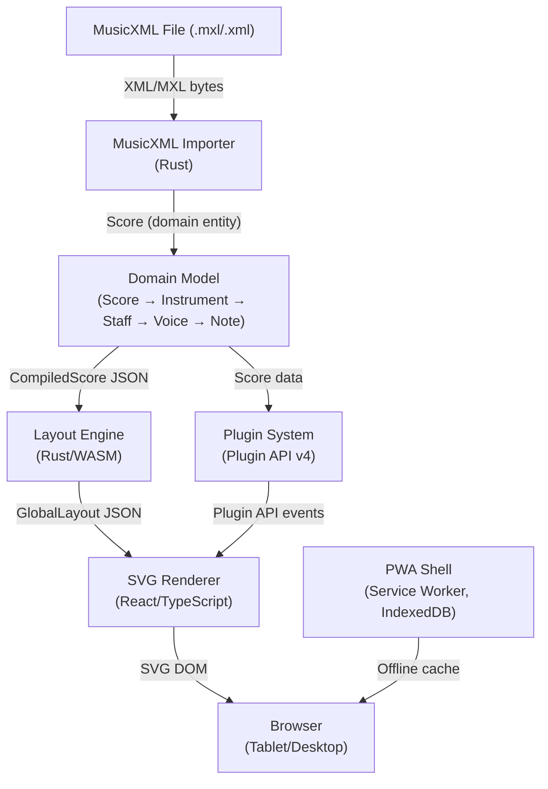

# Graditone Architecture

## Overview

Graditone is a tablet-first Progressive Web Application for interactive music score display and practice. It combines a Rust music engine compiled to WebAssembly with a React/TypeScript frontend to deliver high-performance score rendering, playback, and practice tools — all running offline in the browser. The system follows Domain-Driven Design with a hexagonal architecture, where the Rust core owns all domain logic and layout computation, and the frontend handles rendering and user interaction through a plugin-extensible interface.

## System Architecture

## Components

| Component | Description | Detail Page |
|-----------|-------------|-------------|
| **MusicXML Importer** | Parses .mxl/.xml files into domain Score entities through a three-layer pipeline (parser → converter → domain) | [MusicXML Importer](musicxml-importer.md) |
| **Domain Model** | DDD aggregate root (Score) with hierarchical entities: Instrument → Staff → Voice → Note. 960 PPQ precision timing. | [Rust/WASM Engine](wasm-engine.md) |
| **Layout Engine** | Computes all spatial geometry — positions, spacing, system breaking, bounding boxes — as an 11-stage Rust pipeline compiled to WASM | [Layout Engine](layout-engine.md) |
| **SVG Renderer** | Renders GlobalLayout JSON to SVG DOM with viewport virtualization and incremental highlight updates | [SVG Renderer](svg-renderer.md) |
| **Plugin System** | Extensible plugin architecture (Plugin API v4) for practice tools, playback, virtual keyboard, and custom views | [Plugin System](plugin-system.md) |
| **PWA Shell** | Service Worker, IndexedDB, installable app shell providing offline-first experience across tablets and desktops | [Frontend PWA](frontend-pwa.md) |

## Data Flow

1. **Import**: User loads a `.mxl` or `.xml` file → MusicXML Importer parses it into a `Score` domain entity
2. **Compile**: Score is serialized as `CompiledScore` JSON and passed to the Layout Engine via WASM
3. **Layout**: Layout Engine computes `GlobalLayout` JSON — all glyph positions, system breaks, and bounding boxes
4. **Render**: SVG Renderer receives `GlobalLayout`, virtualizes visible systems, and generates SVG DOM
5. **Interact**: Plugins and user interactions (playback, practice, note selection) communicate through Plugin API events
6. **Cache**: PWA Shell caches assets and scores for offline access via Service Worker and IndexedDB

## See Also

- [Local Validation Guide](LOCAL-VALIDATION.md)
- [Documentation Update Checklist](doc-update-checklist.md) — follow after completing each feature spec
- [README](../README.md) — project overview and quick start
