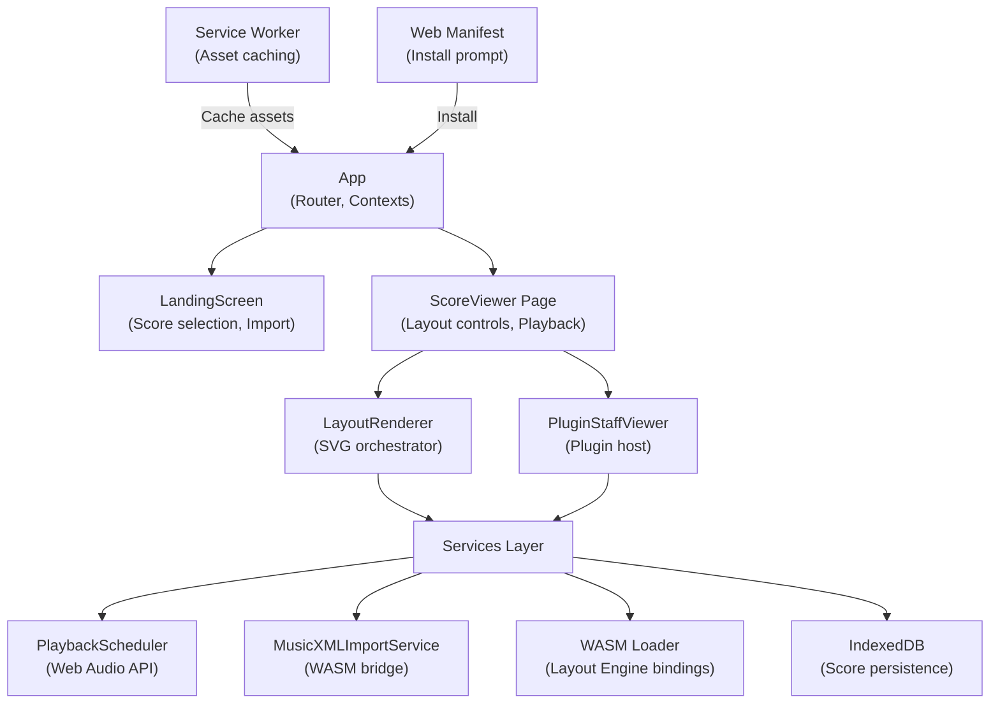

# Frontend PWA

## Overview

The Graditone frontend is a React/TypeScript Progressive Web Application that provides the user interface for score viewing, playback, and practice. It runs entirely in the browser with offline-first capabilities through Service Worker caching and IndexedDB storage. The frontend communicates with the Rust music engine via WASM bindings and exposes an extensible plugin system for practice tools and custom views.

## Architecture

## Modules

| Module | Description |
|--------|-------------|
| **App** | Root component with React Router and context providers (Score, Playback, Metronome, Plugins) |
| **LandingScreen** | Score selection, MusicXML import, demo score loading |
| **ScoreViewer** | Main page — scroll/zoom controls, playback transport, plugin panel toggle |
| **LayoutRenderer** | SVG rendering orchestrator — delegates to RenderingPipeline, HighlightController, InteractionHandler |
| **PluginStaffViewer** | Plugin host component — loads and renders plugin views alongside staff notation |
| **PlaybackScheduler** | Web Audio API scheduling for note-accurate playback with auto-scroll |
| **MusicXMLImportService** | WASM bridge — calls Rust importer via `wasm-bindgen`, returns Score + ImportResult |
| **WASM Loader** | Lazy initializes WASM module, provides `compute_layout()` binding |
| **IndexedDB Storage** | Offline score persistence — saves/loads scores and user preferences |
| **Service Worker** | Workbox-powered — precaches app shell, runtime-caches WASM and font assets |

## Data Flow

**User action** → React component (ScoreViewer) → Service layer (PlaybackScheduler / ImportService) → WASM engine or IndexedDB → State update → Component re-render

**Import flow**: File input → `MusicXMLImportService.import()` → WASM `parse_musicxml()` → Score entity → IndexedDB save → Navigate to ScoreViewer

**Layout flow**: Score loaded → `WASM.compute_layout(compiledScore)` → `GlobalLayout` JSON → `LayoutRenderer` renders SVG

## Key Files

| Module | Path |
|--------|------|
| App entry | `frontend/src/App.tsx` |
| ScoreViewer page | `frontend/src/pages/ScoreViewer.tsx` |
| LandingScreen | `frontend/src/components/LandingScreen.tsx` |
| LayoutRenderer | `frontend/src/components/LayoutRenderer.tsx` |
| Plugin host | `frontend/src/plugin-api/PluginStaffViewer.tsx` |
| Playback service | `frontend/src/services/playback/` |
| Import service | `frontend/src/services/import/` |
| WASM loader | `frontend/src/services/wasm/` |
| Storage service | `frontend/src/services/storage/` |
| Hooks | `frontend/src/hooks/` |
| PWA config | `frontend/vite.config.ts` |

## Dynamics & Volume Pipeline (Feature 063)

MusicXML dynamics (pp–ff) and hairpins (crescendo/diminuendo) are parsed in the Rust backend and assigned as per-note velocity values (1–127). The frontend playback pipeline applies these velocities using a square-root gain curve for perceptually even loudness.

| Layer | Component | Responsibility |
|-------|-----------|----------------|
| Backend | `parse_direction()` | Extracts `<dynamics>`, `<sound dynamics>`, `<wedge>` from MusicXML |
| Backend | `collect_dynamics()` / `collect_gradual_dynamics()` | Builds sorted `DynamicMarking` and `GradualDynamic` arrays |
| Backend | `resolve_velocity()` | Backward scan + linear interpolation to assign per-note velocity |
| Frontend | `DynamicsResolver` | Runtime velocity lookup for seek/jump (mirror of backend logic) |
| Frontend | `volumeUtils.velocityToGain()` | `sqrt(velocity / 127)` gain curve |
| Frontend | `volumeUtils.applyCCScaling()` | Multiplicative CC7 × CC11 scaling |
| Frontend | `ToneAdapter.playNote()` | Passes velocity-based gain to `triggerAttackRelease()` |
| Frontend | `ToneAdapter.attackNote()` | Live MIDI input with sqrt curve + CC scaling |
| Frontend | `ToneAdapter.setMasterVolume()` | Maps 0–100% to -60…0 dB on `Tone.Destination` |
| Frontend | `VolumeSlider` | UI component in playback bar, persisted to localStorage |

## See Also

- [Architecture Overview](architecture.md)
- [SVG Renderer](svg-renderer.md) — rendering pipeline details
- [Plugin System](plugin-system.md) — plugin API and lifecycle
- [Rust/WASM Engine](wasm-engine.md) — WASM bindings and domain model
