# Layout Engine

## Overview

The Layout Engine is a Rust module compiled to WASM that computes all spatial geometry for music score rendering. It takes a `CompiledScore` JSON as input and produces a `GlobalLayout` JSON containing every glyph position, system break, staff line, and bounding box needed by the SVG Renderer. The engine is the sole authority over spatial positioning — the frontend never computes layout independently.

## Architecture

```mermaid
flowchart LR
    INPUT["CompiledScore JSON"]
    EXT["Extraction<br/>(extraction.rs)"]
    SPACE["Spacer<br/>(spacer.rs)"]
    BREAK["Breaker<br/>(breaker.rs)"]
    POS["Positioner<br/>(positioner.rs)"]
    NOTE["NoteLayout<br/>(note_layout.rs)"]
    STRUCT["Structural<br/>(structural.rs)"]
    BEAMS["Beams & Stems<br/>(beams.rs, stems.rs)"]
    ANNOT["Annotations<br/>(annotations.rs)"]
    BAR["Barlines<br/>(barlines.rs)"]
    BATCH["Batcher<br/>(batcher.rs)"]
    ASM["Assembly<br/>(assembly.rs)"]
    OUTPUT["GlobalLayout JSON"]

    INPUT --> EXT
    EXT --> SPACE
    SPACE --> BREAK
    BREAK --> POS
    POS --> NOTE
    NOTE --> STRUCT
    STRUCT --> BEAMS
    BEAMS --> ANNOT
    ANNOT --> BAR
    BAR --> BATCH
    BATCH --> ASM
    ASM --> OUTPUT
```

## Modules

| Module | File | Description |
|--------|------|-------------|
| **Extraction** | `extraction.rs` | Deserializes CompiledScore JSON into typed internal data structures |
| **Spacer** | `spacer.rs` | Computes time-proportional horizontal spacing for notes and events |
| **Breaker** | `breaker.rs` | Determines optimal system (line) breaks based on available width |
| **Positioner** | `positioner.rs` | Assigns absolute (x, y) coordinates to every element |
| **NoteLayout** | `note_layout.rs` | Positions noteheads, accidentals, dots, and stem glyphs |
| **Structural** | `structural.rs` | Positions clefs, key signatures, and time signatures |
| **Beams & Stems** | `beams.rs`, `stems.rs` | Computes beam groups and stem directions/lengths |
| **Annotations** | `annotations.rs` | Positions ties, slurs, ledger lines, and other annotations |
| **Barlines** | `barlines.rs` | Positions barlines at measure boundaries |
| **Batcher** | `batcher.rs` | Optimizes glyphs into GlyphRuns for efficient rendering (6.25% runs-to-glyphs ratio) |
| **Assembly** | `assembly.rs` | Generates staff lines, bounding boxes, and the final GlobalLayout structure |
| **Metrics** | `metrics.rs` | SMuFL glyph metrics and font measurement constants |
| **Staff Groups** | `staff_groups.rs` | Multi-staff instrument grouping (e.g., piano treble + bass) |

## Data Flow

`CompiledScore JSON` → **extraction** (parse into typed structs) → **spacing** (horizontal time-proportional widths) → **breaking** (partition into systems/lines) → **positioning** (absolute x,y for every element) → **note layout** (notehead/accidental/dot glyphs) → **structural** (clef/key/time signature glyphs) → **beams & stems** (beam groups, stem directions) → **annotations** (ties, slurs, ledger lines) → **barlines** (measure boundaries) → **batching** (GlyphRun optimization) → **assembly** (staff lines, bounding boxes) → `GlobalLayout JSON`

**Performance**: 120 KB WASM (gzipped), 36 KB JSON output for 100-measure score, <16ms frame time

## Key Files

| Module | Path |
|--------|------|
| Layout entry | `backend/src/layout/mod.rs` |
| Extraction | `backend/src/layout/extraction.rs` |
| Spacer | `backend/src/layout/spacer.rs` |
| Breaker | `backend/src/layout/breaker.rs` |
| Positioner | `backend/src/layout/positioner.rs` |
| NoteLayout | `backend/src/layout/note_layout.rs` |
| Structural | `backend/src/layout/structural.rs` |
| Beams | `backend/src/layout/beams.rs` |
| Stems | `backend/src/layout/stems.rs` |
| Annotations | `backend/src/layout/annotations.rs` |
| Barlines | `backend/src/layout/barlines.rs` |
| Batcher | `backend/src/layout/batcher.rs` |
| Assembly | `backend/src/layout/assembly.rs` |
| Metrics | `backend/src/layout/metrics.rs` |
| WASM bindings | `backend/src/layout/wasm.rs` |

## See Also

- [Architecture Overview](architecture.md)
- [Rust/WASM Engine](wasm-engine.md) — hexagonal architecture and domain model
- [SVG Renderer](svg-renderer.md) — consumes GlobalLayout JSON for rendering
