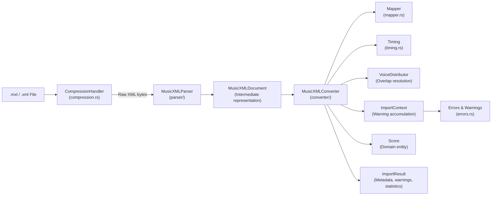

# MusicXML Importer

## Overview

The MusicXML Importer is a Rust module that parses `.mxl` (compressed) and `.xml` (raw) MusicXML files into Graditone's domain `Score` entity. It implements a three-layer pipeline — compression handling, XML parsing into an intermediate `MusicXMLDocument`, and conversion to the domain model — with comprehensive error handling, warning accumulation, and support for complex MusicXML features like overlapping notes, voice splitting, and structural event recovery.

## Architecture

## Modules

| Module | Description |
|--------|-------------|
| **CompressionHandler** | Detects file type (.mxl ZIP vs .xml raw), decompresses .mxl archives, extracts root XML file |
| **MusicXMLParser** | Parses XML into `MusicXMLDocument` — an intermediate representation preserving MusicXML's structure (parts, measures, note elements) |
| **MusicXMLConverter** | Transforms `MusicXMLDocument` into domain `Score` entity — the core conversion logic |
| **Mapper** | Maps MusicXML enumerated values to domain enums (clef types, key modes, accidentals, note types) |
| **Timing** | Lossless fraction-based timing conversion — MusicXML divisions → 960 PPQ domain ticks |
| **VoiceDistributor** | Resolves overlapping notes by distributing them across multiple voices when needed |
| **Errors** | Error and warning categorization — distinguishes fatal errors from recoverable warnings |
| **ImportContext** | Accumulates warnings and metadata during import — provides `ImportResult` with statistics |

## Data Flow

`.mxl/.xml` → **CompressionHandler** detects format, decompresses if .mxl → **MusicXMLParser** parses raw XML into `MusicXMLDocument` intermediate representation → **MusicXMLConverter** walks the intermediate structure, using **Mapper** for enum translation and **Timing** for PPQ conversion → **VoiceDistributor** resolves overlapping notes → **ImportContext** accumulates warnings via **Errors** → Outputs: `Score` (domain entity) + `ImportResult` (metadata, warnings, statistics)

**Validated with**: Bach Inventions, Beethoven Fur Elise, Chopin Nocturnes, Burgmuller Arabesque, Mozart Piano Sonatas, Pachelbel Canon

## Key Files

| Module | Path |
|--------|------|
| Importer entry | `backend/src/domain/importers/musicxml/mod.rs` |
| Compression | `backend/src/domain/importers/musicxml/compression.rs` |
| Parser | `backend/src/domain/importers/musicxml/parser/` |
| Converter | `backend/src/domain/importers/musicxml/converter/` |
| Mapper | `backend/src/domain/importers/musicxml/mapper.rs` |
| Timing | `backend/src/domain/importers/musicxml/timing.rs` |
| Types | `backend/src/domain/importers/musicxml/types.rs` |
| Errors | `backend/src/domain/importers/musicxml/errors.rs` |
| Ports interface | `backend/src/ports/importers.rs` |

## See Also

- [Architecture Overview](architecture.md)
- [Rust/WASM Engine](wasm-engine.md) — hexagonal architecture hosting the importer
- [Layout Engine](layout-engine.md) — consumes the Score entity produced by the importer
