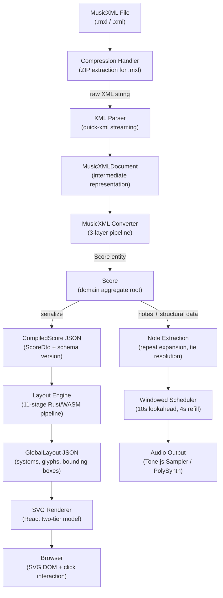

# MusicXML Processing Pipeline

## Overview

This document is a comprehensive reference for the MusicXML processing pipeline in Graditone — the complete data flow from a `.mxl`/`.xml` file to rendered score visualization (SVG) and audio playback. It is intended as a decision-support reference: when planning features that touch accidentals, articulations, dynamics, note rendering, or playback behavior, consult this document to understand what data is parsed, how it is stored, how it flows through layout and rendering, and how it reaches the audio output.

For the high-level system architecture and component overview, see [Architecture](architecture.md).



> **Maintenance**: When a feature modifies any processing stage described here, update this document as part of the spec completion. See [Documentation Update Checklist](doc-update-checklist.md).

---

## MusicXML Import Pipeline

The MusicXML Importer is a three-layer Rust pipeline that converts `.mxl`/`.xml` files into the domain `Score` entity. For the full importer deep dive, see [MusicXML Importer](musicxml-importer.md).

### Three-Layer Architecture

| Layer | Module | Input | Output |
|-------|--------|-------|--------|
| **1. Compression** | `compression.rs` | File bytes | Raw XML string |
| **2. Parser** | `parser/mod.rs` (~1100 lines) | XML string | `MusicXMLDocument` (intermediate) |
| **3. Converter** | `converter/mod.rs` (~1300 lines) | `MusicXMLDocument` + `ImportContext` | Domain `Score` entity |

**Layer 1 — Compression**: Detects file type (`.mxl` ZIP archive vs `.xml` plain text). For `.mxl` files, reads the `container.xml` manifest to locate the root XML file and extracts it. Uses the `zip` crate. Native-only (not WASM-compatible — WASM receives pre-extracted XML strings via `parse_musicxml()`).

**Layer 2 — XML Parser**: Streaming parser using the `quick-xml` crate. Parses score-partwise structure into an intermediate `MusicXMLDocument` representation that preserves MusicXML's own hierarchy (parts, measures, note elements). Key parsing functions:

- `parse_score_partwise()` — Score structure and metadata
- `parse_part_list()` — Instrument metadata
- `parse_measure()` — Measure content (notes, rests, attributes, directions)
- `parse_note()` — Individual notes with 15+ attributes (pitch, duration, beams, ties, slurs, articulations)
- `parse_attributes()` — Clef, key signature, time signature, divisions (PPQ)
- `parse_barline_content()` — Repeat markers, volta brackets
- `parse_direction()` — Octave shifts (8va/8vb/15ma), dynamics, wedges

**Layer 3 — Converter**: Transforms `MusicXMLDocument` into the domain `Score` entity. Key responsibilities:

- Convert `PartData` → `Instrument` entities (handling multi-staff instruments like piano)
- Resolve timing from MusicXML `divisions` to 960 PPQ using lossless fraction-based arithmetic (`timing.rs`)
- Distribute overlapping notes across voices using the `VoiceDistributor`
- Extract structural features: repeat barlines, volta brackets, octave-shift regions, dynamic markings, gradual dynamics

### Supporting Modules

| Module | Purpose |
|--------|---------|
| `mapper.rs` | Enum translation: clef types ("G" → Treble), pitch names, key signatures, accidental types |
| `timing.rs` | Lossless fraction-based conversion: MusicXML divisions → 960 PPQ ticks |
| `errors.rs` | Severity-categorized warnings: Info, Warning, Error. Categories: OverlapResolution, MissingElements, StructuralIssues, PartialImport |
| `types.rs` | Intermediate data structures: `NoteData`, `RestData`, `BeamData`, `TieType`, `SlurInfo` |

### Import Result

The WASM `parse_musicxml()` function returns a `WasmImportResult`:

```
WasmImportResult {
  score: Score,              // Full domain model
  metadata: {
    format: "MusicXML 3.1",
    work_title?: string,
    composer?: string
  },
  statistics: {
    instrument_count, staff_count, voice_count,
    note_count, duration_ticks,
    warning_count, skipped_element_count
  },
  warnings: ImportWarning[],
  partial_import: boolean    // True if Error-level warnings occurred
}
```

---

## Domain Model

The domain model follows Domain-Driven Design with `Score` as the aggregate root. All timing uses 960 PPQ (pulses per quarter note) integer arithmetic — no floating-point timing. For the full WASM engine details, see [Rust/WASM Engine](wasm-engine.md).

### Entity Hierarchy

```
Score (aggregate root)
├── global_structural_events: Vec<GlobalStructuralEvent>  (Tempo, TimeSignature)
├── instruments: Vec<Instrument>
│   └── staves: Vec<Staff>
│       ├── staff_structural_events: Vec<StaffStructuralEvent>  (Clef, KeySignature)
│       └── voices: Vec<Voice>
│           ├── interval_events: Vec<Note>
│           └── rest_events: Vec<RestEvent>
├── repeat_barlines: Vec<RepeatBarline>
├── volta_brackets: Vec<VoltaBracket>
├── octave_shift_regions: Vec<OctaveShiftRegion>
├── dynamics: Vec<DynamicMarking>
├── gradual_dynamics: Vec<GradualDynamic>
├── phrases: Vec<PhraseRegion>
└── difficulty_rating: Option<DifficultyRating>
```

### Key Struct Definitions (Rust)

**Score** — `backend/src/domain/score.rs`:

```rust
pub struct Score {
    pub id: ScoreId,
    pub global_structural_events: Vec<GlobalStructuralEvent>,
    pub instruments: Vec<Instrument>,
    pub repeat_barlines: Vec<RepeatBarline>,        // Feature 041
    pub volta_brackets: Vec<VoltaBracket>,           // Feature 047
    pub pickup_ticks: u32,                           // Feature 044: anacrusis duration
    pub measure_end_ticks: Vec<u32>,                 // Actual cumulative tick per measure
    pub octave_shift_regions: Vec<OctaveShiftRegion>, // Feature 050
    pub difficulty_rating: Option<DifficultyRating>,  // Feature 055
    pub phrases: Vec<PhraseRegion>,                  // Feature 062
    pub dynamics: Vec<DynamicMarking>,               // Feature 063
    pub gradual_dynamics: Vec<GradualDynamic>,       // Feature 063
}
```

**Instrument** — `backend/src/domain/instrument.rs`:

```rust
pub struct Instrument {
    pub id: InstrumentId,
    pub name: String,
    pub instrument_type: String,  // MVP: always "piano"
    pub staves: Vec<Staff>,
}
```

**Staff** — `backend/src/domain/staff.rs`:

```rust
pub struct Staff {
    pub id: StaffId,
    pub staff_structural_events: Vec<StaffStructuralEvent>,
    pub voices: Vec<Voice>,
}
```

**Voice** — `backend/src/domain/voice.rs`:

```rust
pub struct Voice {
    pub id: VoiceId,
    pub interval_events: Vec<Note>,
    pub rest_events: Vec<RestEvent>,
}
```

**Note** — `backend/src/domain/events/note.rs`:

```rust
pub struct Note {
    pub id: NoteId,
    pub start_tick: Tick,                   // 960 PPQ position
    pub duration_ticks: u32,                // Always > 0
    pub pitch: Pitch,                       // MIDI 0–127
    pub spelling: Option<NoteSpelling>,     // Enharmonic: D# vs Eb
    pub beams: Vec<NoteBeamData>,           // Beam grouping
    pub staccato: bool,                     // Playback: halve duration
    pub dot_count: u8,                      // 0, 1 (dotted), 2 (double-dotted)
    pub tie_next: Option<NoteId>,           // Next note in tie chain
    pub is_tie_continuation: bool,          // No new attack in playback
    pub slur_next: Option<NoteId>,          // Slur endpoint
    pub slur_above: Option<bool>,           // Slur curvature direction
    pub is_grace: bool,                     // Ornamental, reduced size
    pub has_explicit_accidental: bool,      // MusicXML courtesy accidental
    pub stem_down: Option<bool>,            // Explicit stem direction
    pub fingering: Vec<FingeringAnnotation>, // Digits 1–5
    pub velocity: Option<u8>,              // MIDI 1–127 from dynamics (Feature 063)
}
```

**NoteSpelling** — `backend/src/domain/value_objects.rs`:

```rust
pub struct NoteSpelling {
    pub step: char,  // 'C', 'D', 'E', 'F', 'G', 'A', 'B'
    pub alter: i8,   // -1 = flat, 0 = natural, 1 = sharp
}
```

### Structural Data Types

**RepeatBarline** — `backend/src/domain/repeat.rs`:

```rust
pub struct RepeatBarline {
    pub measure_index: u32,           // 0-based measure index
    pub start_tick: u32,
    pub end_tick: u32,
    pub barline_type: RepeatBarlineType, // Start | End | Both
}
```

**VoltaBracket** — `backend/src/domain/repeat.rs`:

```rust
pub struct VoltaBracket {
    pub number: u8,                  // 1 = first ending, 2 = second ending
    pub start_measure_index: u32,
    pub end_measure_index: u32,
    pub start_tick: u32,
    pub end_tick: u32,
    pub end_type: VoltaEndType,      // Stop | Discontinue
}
```

**OctaveShiftRegion** — `backend/src/domain/score.rs`:

```rust
pub struct OctaveShiftRegion {
    pub start_tick: u32,
    pub end_tick: u32,
    pub display_shift: i8,    // -12 for 8va, +12 for 8vb, -24 for 15ma
    pub staff_index: usize,
}
```

**PhraseRegion** — `backend/src/domain/phrases.rs`:

```rust
pub struct PhraseRegion {
    pub instrument_index: usize,
    pub start_measure: usize,
    pub end_measure: usize,    // Inclusive
    pub start_tick: u32,
    pub end_tick: u32,
}
```

### Key Value Objects

| Type | Description | Range |
|------|-------------|-------|
| **Tick** | Absolute position in 960 PPQ timeline | 0–∞ (integer) |
| **Pitch** | MIDI pitch number | 0–127 |
| **BPM** | Beats per minute | 20–400 |
| **Clef** | Staff clef type | Treble, Bass, Alto, Tenor |
| **KeySignature** | Key signature fifths | -7 (7 flats) to +7 (7 sharps) |

### DTO Layer & Schema Versioning

The `Score` domain entity is serialized to `ScoreDto` (`backend/src/adapters/dtos.rs`) for frontend consumption. The DTO adds a computed `active_clef` field per staff (extracted from the first `ClefEvent`, defaulting to Treble).

**Schema version** tracks structural evolution of the DTO. The frontend checks cached scores against the current version and re-imports from the original MXL if the cached version is older.

```
SCORE_SCHEMA_VERSION = 12 (current)

Version history:
  v2:  active_clef added to StaffDto
  v3:  WASM returns ScoreDto instead of raw Score
  v4:  repeat_barlines added
  v5:  rest_events added to Voice
  v6:  pickup_ticks (anacrusis support)
  v7:  volta_brackets
  v8:  octave_shift_regions
  v9:  fingering annotations
  v10: difficulty_rating
  v11: phrases
  v12: dynamics and gradual_dynamics
```

---

## WASM Bridge

The Rust backend is compiled to WebAssembly via `wasm-pack` and exposed to the TypeScript frontend through `wasm-bindgen` exports. For the full WASM engine details, see [Rust/WASM Engine](wasm-engine.md).

### Exported Functions

All exports are in `backend/src/adapters/wasm/bindings.rs`:

| Function | Input | Output | Purpose |
|----------|-------|--------|---------|
| `parse_musicxml(xml_content)` | MusicXML string | `WasmImportResult` | Parse MusicXML into domain Score |
| `compute_layout_wasm(score_json, config_json)` | CompiledScore JSON, LayoutConfig JSON | GlobalLayout JSON | Compute all spatial geometry |
| `get_schema_version()` | — | `u32` | Current schema version for cache validation |
| `create_score(title?)` | Optional title | Score JSON | Create empty score (120 BPM, 4/4) |
| `add_instrument(score_js, name)` | Score + name | Updated Score | Add instrument to score |
| `add_staff(score_js, instrument_id)` | Score + UUID | Updated Score | Add staff to instrument |
| `add_voice(score_js, staff_id)` | Score + UUID | Updated Score | Add voice to staff |
| `add_note(score_js, voice_id, note_js)` | Score + UUID + Note | Updated Score | Add note with validation |
| `add_tempo_event(score_js, tick, bpm)` | Score + position + BPM | Updated Score | Add tempo change |
| `add_time_signature_event(score_js, tick, num, den)` | Score + position + sig | Updated Score | Add time signature change |
| `add_clef_event(score_js, staff_id, tick, clef_type)` | Score + staff + clef | Updated Score | Add clef change |
| `add_key_signature_event(score_js, staff_id, tick, key)` | Score + staff + key | Updated Score | Add key signature change |

### JSON Serialization Flow

```
Score (Rust domain entity)
    ↓ Score::to_dto()
ScoreDto (Rust DTO with active_clef, schema_version)
    ↓ serde_json::to_string()
CompiledScore JSON (string passed to frontend via JsValue)
    ↓ JSON.parse() in TypeScript
CompiledScore (TypeScript interface)
```

### Cache Invalidation

```
Frontend loads cached score from IndexedDB
    ↓
Compare cachedScore.schema_version vs get_schema_version()
    ↓
If cached < current → discard cache, re-import from original .mxl
If cached == current → use cached score
```

### WASM Loader

The frontend lazily loads the WASM module via dynamic import (`frontend/src/services/wasm/loader.ts`):

1. Import `{BASE_URL}/wasm/musicore_backend.js` via dynamic `import()`
2. Call `wasm.default()` to auto-load the `.wasm` binary
3. Deduplication guard (`initializationPromise`) prevents concurrent loads
4. Service Worker precaching ensures offline availability after first load

---

## Layout Engine

The Layout Engine is an 11-stage Rust pipeline compiled to WASM that computes all spatial geometry for score rendering. The Rust/WASM engine is the **sole authority** for layout computation — the frontend renderer may not calculate, modify, or derive any logical coordinates. For the full layout deep dive, see [Layout Engine](layout-engine.md).

### Pipeline Stages

The `compute_layout_wasm(score_json, config_json)` function executes these stages sequentially:

| # | Stage | Module | Purpose |
|---|-------|--------|---------|
| 1 | Extraction | `extraction.rs` | Parse CompiledScore JSON → typed structs |
| 2 | Spacing | `spacer.rs` | Time-proportional horizontal widths (base 30 + duration × 50) |
| 3 | Breaking | `breaker.rs` | Partition measures into systems (lines) via greedy packing |
| 4 | Positioning | `positioner.rs` | Compute absolute (x, y) for every element |
| 5 | NoteLayout | `note_layout.rs` | Position noteheads, accidentals, dots, stems |
| 6 | Structural | `structural.rs` | Position clefs, key signatures, time signatures |
| 7 | Beams | `beams.rs` | Beam groups and angles |
| 8 | Stems | `stems.rs` | Stem directions and lengths |
| 9 | Annotations | `annotations.rs` | Ties, slurs (Bézier curves), ledger lines |
| 10 | Barlines | `barlines.rs` | Position barlines at measure boundaries |
| 11 | Batching | `batcher.rs` | Optimize glyphs into GlyphRuns (80–90% DOM reduction) |
| 12 | Assembly | `assembly.rs` | Generate staff lines, bounding boxes, final GlobalLayout |

### Input & Output

**Input**: `CompiledScore` JSON + `LayoutConfig` JSON (viewport dimensions, scaling)

**Output**: `GlobalLayout` JSON:

```
GlobalLayout
├── systems: System[]           // One per line of music
│   ├── bounding_box: {x, y, width, height}
│   ├── tick_range: {start, end}
│   ├── staff_groups: StaffGroup[]
│   │   └── staves: Staff[]
│   │       ├── glyph_runs: GlyphRun[]     // Batched note/accidental glyphs
│   │       │   └── glyphs: Glyph[]
│   │       │       ├── position: {x, y}    // Logical units
│   │       │       ├── codepoint: string    // SMuFL Unicode (e.g., U+E0A4)
│   │       │       └── source_reference: {type: "Note", id: "uuid"}
│   │       ├── structural_glyphs: Glyph[]  // Clefs, key sigs, time sigs
│   │       ├── bar_lines: BarLine[]
│   │       ├── tie_arcs: TieArc[]          // Precomputed Bézier curves
│   │       ├── slur_arcs: TieArc[]
│   │       ├── ledger_lines: LedgerLine[]
│   │       └── fingering_glyphs: FingeringGlyph[]
│   ├── volta_bracket_layouts: VoltaBracketLayout[]
│   └── ottava_bracket_layouts: OttavaBracketLayout[]
├── total_width: number
├── total_height: number
└── units_per_space: number     // Scaling: 10 logical units per staff space
```

### Coordinate System

- **Units**: Logical units (1 staff space = 10 units by default, controlled by `units_per_space`)
- **Origin**: Top-left
- **Y-axis**: Downward (increasing Y = lower on screen)
- **Font**: SMuFL standard via Bravura font — each musical symbol has a Unicode codepoint

### GlyphRun Batching

Consecutive glyphs sharing the same font family, font size, color, and opacity are packed into a single `GlyphRun`. This reduces SVG DOM nodes by 80–90% compared to individual glyph elements, enabling smooth rendering performance on tablets.

---

## SVG Rendering

The SVG Renderer is a React/TypeScript component that converts `GlobalLayout` JSON into an interactive SVG display. It operates as a pure display adapter — all spatial decisions come from the Layout Engine. For the full rendering deep dive, see [SVG Renderer](svg-renderer.md).

### Two-Tier Rendering Model

| Tier | Trigger | Cost | What It Does |
|------|---------|------|-------------|
| **Full Structural Render** | Layout, config, or source map change | High (rebuilds SVG DOM) | `RenderingPipeline.renderAll()` traverses System → StaffGroup → Staff → GlyphRun → Glyph, creating `<text>` and `<rect>` SVG elements |
| **Incremental Highlight** | Every `requestAnimationFrame` (~60fps) | Low (CSS attribute patches) | `HighlightController` updates `fill` and `opacity` on existing `data-note-id` elements for playback cursor, note selection, and practice highlights |

### Viewport Virtualization

Only visible systems are rendered to the SVG DOM:

1. `getVisibleSystems()` binary-searches the system `bounding_box` array against the viewport rectangle
2. Typically 3–5 systems visible at once on a tablet
3. Off-screen systems produce zero DOM nodes

### GlyphRun → SVG

For each visible system, the rendering pipeline:

1. Creates a `<g>` element per GlyphRun (shared font, size, color)
2. For each Glyph in the run:
   - Creates a `<text>` element with the SMuFL codepoint positioned at `(glyph.x, glyph.y)`
   - Creates a transparent `<rect>` hit overlay for noteheads (carries `data-note-id` for click detection)
3. Renders barlines, staff lines, ledger lines, tie/slur arcs

### Click-to-Note Interaction

```
User clicks/taps SVG
  → Hit overlay identifies glyph's source_reference (Note ID)
  → Playback seeks to note.start_tick
  → Highlight state updated
  → Metadata panel shows note details
```

---

## Playback Pipeline

The playback pipeline extracts notes from the `Score`, resolves structural transformations (repeats, ties), converts musical timing to real-time seconds, and schedules audio events through Tone.js.

### Pipeline Flow

```
Score
  ↓ expandNotesWithRepeats() [RepeatNoteExpander.ts]
Repeat-expanded Note[]
  ↓ resolveTiedNotes() [TieResolver.ts]
Tie-resolved Note[] (continuations removed, durations merged)
  ↓ scheduleNotes() [PlaybackScheduler.ts]
Windowed scheduling (10s lookahead, 4s refill)
  ↓ playNote() [ToneAdapter.ts]
Tone.Transport → Sampler.triggerAttackRelease()
  ↓
Audio output (piano samples or synth)
```

### Timing Conversion

All timing uses 960 PPQ (pulses per quarter note). The conversion formula:

```
seconds = ticks / (tempo_bpm / 60 × 960)
```

| Duration | Ticks | @ 120 BPM | @ 60 BPM |
|----------|-------|-----------|----------|
| Whole note | 3840 | 2.0s | 4.0s |
| Half note | 1920 | 1.0s | 2.0s |
| Quarter note | 960 | 0.5s | 1.0s |
| Eighth note | 480 | 0.25s | 0.5s |
| Sixteenth note | 240 | 0.125s | 0.25s |

### Repeat Expansion

`RepeatNoteExpander.ts` processes repeat barlines and volta brackets to expand a flat `Note[]` into the full repeated sequence:

- End-repeat barlines cause notes to be duplicated for the repeated section
- First-ending notes (volta 1) are skipped on the second pass
- Second-ending notes (volta 2) are used only on the second pass
- Tick offsets are adjusted so the expanded sequence has continuous timing

### Tie Resolution

`TieResolver.ts` merges tied notes into single playback events:

- Notes with `is_tie_continuation === true` are removed from the playback schedule
- Their durations are accumulated into the tie-starting note's `combinedDurationTicks`
- Result: one `attackNote()` call with the full tied duration

### Windowed Scheduling

`PlaybackScheduler.ts` uses windowed scheduling to prevent Tone.js timeline bloat on mobile:

| Parameter | Value |
|-----------|-------|
| **Lookahead** | 10 seconds |
| **Refill interval** | 4 seconds |
| **PPQ** | 960 |
| **Min note duration** | 50ms (floor for very short notes) |

1. `scheduleWindow()` schedules all notes within the current 10-second window
2. `startRefillLoop()` registers a repeating Transport event every 4 seconds to schedule upcoming notes
3. `pendingIndex` pointer prevents re-scheduling already-queued notes

### Note Duration Modifiers

- **Staccato**: Duration halved (0.5×), minimum 50ms floor
- **Tempo multiplier**: Duration divided by the user's playback speed setting
- **Tied notes**: Accumulated duration from tie chain

### Velocity

- **Source**: `Note.velocity` (1–127), computed by the backend's DynamicsResolver from active `DynamicMarking` at the note's tick position
- **Default**: 80 (mf) when no dynamics are present
- **Delivery**: Passed to `ToneAdapter.playNote()` → converted to gain (velocity / 127)

### Audio Source

**Primary**: `Tone.Sampler` loaded with Salamander Grand Piano samples (24 notes: A0–C8) from `public/audio/salamander/`. Release time: 1 second. Volume: -5 dB.

**Fallback**: `Tone.PolySynth` if samples fail to load. Envelope: attack 5ms, decay 100ms, sustain 30%, release 1s.

**Initialization**: `ToneAdapter.init()` must be called after a user interaction (click/touch) to satisfy browser autoplay policy. `Tone.start()` resumes the suspended `AudioContext`.

---

## Musical Feature Focus: Accidentals

This section traces accidental handling through the complete pipeline — useful when planning changes to accidental rendering rules or enharmonic spelling.

### MusicXML Parsing

MusicXML encodes accidentals in two places:

```xml
<note>
  <pitch>
    <step>D</step>
    <alter>1</alter>     <!-- Chromatic alteration: -1 flat, 0 natural, 1 sharp -->
    <octave>4</octave>
  </pitch>
  <accidental>sharp</accidental>  <!-- Display hint: courtesy/editorial accidental -->
</note>
```

The parser extracts both: `alter` provides the pitch modification, `accidental` provides the display hint.

### Domain Storage

Three fields on `Note` store accidental data:

| Field | Type | Purpose |
|-------|------|---------|
| `pitch` | `Pitch` (u8, MIDI 0–127) | Absolute pitch including the accidental effect. D#4 = MIDI 63. |
| `spelling` | `Option<NoteSpelling>` | Preserves enharmonic representation: `{step: 'D', alter: 1}` for D♯ vs `{step: 'E', alter: -1}` for E♭ — same MIDI pitch, different spelling. |
| `has_explicit_accidental` | `bool` | `true` when MusicXML includes an `<accidental>` element (courtesy/editorial). Layout engine always shows the accidental glyph regardless of key signature context. |

### Layout

The Layout Engine's `note_layout.rs` stage positions accidental glyphs using SMuFL codepoints:

| Accidental | SMuFL Codepoint | Unicode |
|------------|-----------------|---------|
| Flat (♭) | accidentalFlat | U+E260 |
| Natural (♮) | accidentalNatural | U+E261 |
| Sharp (♯) | accidentalSharp | U+E262 |

Accidentals are positioned to the left of the notehead within the glyph's GlyphRun.

### Rendering

Standard GlyphRun rendering — accidental glyphs are `<text>` SVG elements positioned by the layout engine. No special rendering logic.

### Playback

Accidentals are already encoded in `Note.pitch` (MIDI value). No additional playback logic needed — the sampler plays the correct pitch directly.

---

## Musical Feature Focus: Dynamics & Velocity

This section traces dynamics and velocity handling through the complete pipeline — useful when planning changes to volume control, expression, or articulation effects.

### MusicXML Parsing

Dynamics are encoded as `<direction>` elements:

```xml
<!-- Sustained dynamic -->
<direction>
  <direction-type>
    <dynamics><mf/></dynamics>
  </direction-type>
</direction>

<!-- Gradual dynamic (crescendo/diminuendo) -->
<direction>
  <direction-type>
    <wedge type="crescendo"/>   <!-- or type="diminuendo" -->
  </direction-type>
</direction>
<!-- ... later ... -->
<direction>
  <direction-type>
    <wedge type="stop"/>
  </direction-type>
</direction>
```

The converter extracts these into `DynamicMarking` and `GradualDynamic` entities on the `Score`.

### Domain Storage

**DynamicMarking** — `backend/src/domain/events/dynamics.rs`:

```rust
pub struct DynamicMarking {
    pub marking: DynamicLevel,  // PPP, PP, P, MP, MF, F, FF, FFF
    pub velocity: u8,           // MIDI velocity 1–127
    pub start_tick: Tick,       // Position where this dynamic takes effect
    pub staff: u8,              // Staff number (1-based)
}
```

**GradualDynamic** — `backend/src/domain/events/dynamics.rs`:

```rust
pub struct GradualDynamic {
    pub direction: GradualDirection,  // Crescendo | Diminuendo
    pub start_tick: Tick,
    pub stop_tick: Tick,
    pub staff: u8,
    pub number: u8,                   // MusicXML wedge number
}
```

**DynamicLevel → MIDI Velocity Mapping**:

| Level | MIDI Velocity |
|-------|---------------|
| PPP | 16 |
| PP | 33 |
| P | 49 |
| MP | 64 |
| MF | 80 |
| F | 96 |
| FF | 112 |
| FFF | 127 |

### Velocity Computation

The backend's DynamicsResolver computes `Note.velocity` for each note:

1. Find the most recent `DynamicMarking` at or before `note.start_tick` on the same staff
2. If the note falls within a `GradualDynamic` range: linearly interpolate velocity between the marking before the wedge and the marking after
3. Store the computed velocity as `Note.velocity: Option<u8>`
4. `None` = no dynamics specified → frontend uses default 80 (mf)

### Rendering

Dynamic text glyphs (pp, mf, ff, etc.) and wedge hairpin lines are **not yet rendered** in the layout engine. Dynamics currently affect only playback velocity. Rendering is planned for a future feature.

### Playback

1. `PlaybackScheduler` reads `note.velocity` (or defaults to 80)
2. Velocity is converted to gain: `gain = velocity / 127`
3. `ToneAdapter.playNote()` passes the gain to `Sampler.triggerAttackRelease()`
4. Result: louder notes for forte passages, softer for piano passages

---

## Implementation Status Matrix

| Feature | Parsed | Rendered | Played Back | Notes |
|---------|--------|----------|-------------|-------|
| **Notes** (pitch/duration) | ✅ | ✅ | ✅ | Complete |
| **Accidentals** (♯/♭/♮) | ✅ | ✅ | ✅ (via pitch) | Enharmonic spelling preserved in `NoteSpelling` |
| **Staccato** | ✅ | ✅ (dot glyph) | ✅ (0.5× duration) | Complete |
| **Ties** | ✅ | ✅ (TieArc) | ✅ (merged) | `TieResolver` merges into single event |
| **Slurs** | ✅ | ✅ (SlurArc) | ❌ | No phrasing effect on playback |
| **Beams** | ✅ | ✅ | N/A | Display-only grouping indicator |
| **Grace notes** | ✅ | ✅ (smaller glyph) | ❓ | Layout respects `is_grace`; playback behavior TBD |
| **Dynamics** (pp–fff) | ✅ | ❌ (no text glyph) | ✅ (velocity) | Feature 063: velocity mapping only |
| **Crescendo/Diminuendo** | ✅ | ❌ (no wedge glyph) | ✅ (interpolated) | Feature 063: linear interpolation |
| **Repeat barlines** | ✅ | ✅ | ✅ | `RepeatNoteExpander` handles playback |
| **Volta brackets** | ✅ | ✅ | ✅ | Volta-aware repeat expansion |
| **Octave shifts** (8va/8vb) | ✅ | ✅ (bracket) | ❌ | Display-only; no playback transposition |
| **Key signatures** | ✅ | ✅ | N/A | No playback effect |
| **Time signatures** | ✅ | ✅ | N/A | Used in layout only |
| **Tempo markings** | ✅ | ❌ (no glyph) | ✅ | `TempoEvent` drives Transport speed |
| **Fingering** | ✅ | ✅ | N/A | Display-only annotation |
| **Phrases** | ✅ (backend-detected) | ✅ (color bands) | ❌ | Feature 062: structural detection |
| **Rests** | ✅ | ✅ | N/A | Silence — no sound scheduled |

---

## Key Files Reference

### Backend (Rust/WASM)

| Module | File Path | Purpose |
|--------|-----------|---------|
| Import service | `backend/src/domain/importers/musicxml/mod.rs` | Import orchestration |
| XML parser | `backend/src/domain/importers/musicxml/parser/mod.rs` | MusicXML → intermediate `MusicXMLDocument` |
| Converter | `backend/src/domain/importers/musicxml/converter/mod.rs` | Intermediate → domain `Score` |
| Mapper | `backend/src/domain/importers/musicxml/mapper.rs` | Enum translations (clef, pitch, key) |
| Timing | `backend/src/domain/importers/musicxml/timing.rs` | Lossless divisions → 960 PPQ |
| Errors | `backend/src/domain/importers/musicxml/errors.rs` | Warning categorization |
| Score | `backend/src/domain/score.rs` | Aggregate root + `OctaveShiftRegion` |
| Instrument | `backend/src/domain/instrument.rs` | Instrument entity |
| Staff | `backend/src/domain/staff.rs` | Staff entity |
| Voice | `backend/src/domain/voice.rs` | Voice entity |
| Note | `backend/src/domain/events/note.rs` | Note entity + articulations |
| Dynamics | `backend/src/domain/events/dynamics.rs` | `DynamicLevel`, `DynamicMarking`, `GradualDynamic` |
| Repeats | `backend/src/domain/repeat.rs` | `RepeatBarline`, `VoltaBracket` |
| Phrases | `backend/src/domain/phrases.rs` | `PhraseRegion` |
| Value objects | `backend/src/domain/value_objects.rs` | `NoteSpelling`, `Tick`, `Pitch` |
| DTOs | `backend/src/adapters/dtos.rs` | `ScoreDto`, `SCORE_SCHEMA_VERSION` |
| WASM bindings | `backend/src/adapters/wasm/bindings.rs` | All `#[wasm_bindgen]` exports |
| Layout pipeline | `backend/src/layout/mod.rs` | 11-stage layout engine |
| Spacing | `backend/src/layout/spacer.rs` | Time-proportional widths |
| Breaking | `backend/src/layout/breaker.rs` | System (line) breaking |
| Positioning | `backend/src/layout/positioner.rs` | Absolute x,y coordinates |
| Note layout | `backend/src/layout/note_layout.rs` | Notehead, accidental, dot positioning |
| Batching | `backend/src/layout/batcher.rs` | GlyphRun optimization |

### Frontend (TypeScript/React)

| Module | File Path | Purpose |
|--------|-----------|---------|
| Score types | `frontend/src/types/score.ts` | TypeScript `Note`, `Score`, `DynamicMarking` interfaces |
| Layout types | `frontend/src/wasm/layout.ts` | `GlobalLayout`, `System`, `GlyphRun`, `Glyph` interfaces |
| WASM loader | `frontend/src/services/wasm/loader.ts` | Lazy WASM module initialization |
| Layout renderer | `frontend/src/components/LayoutRenderer.tsx` | SVG rendering orchestrator |
| Rendering pipeline | `frontend/src/components/renderer/RenderingPipeline.ts` | SVG DOM generation |
| Highlight controller | `frontend/src/components/renderer/HighlightController.ts` | Incremental highlight updates |
| Render utilities | `frontend/src/utils/renderUtils.ts` | `getVisibleSystems()` viewport virtualization |
| Playback scheduler | `frontend/src/services/playback/PlaybackScheduler.ts` | Windowed note scheduling |
| Tone adapter | `frontend/src/services/playback/ToneAdapter.ts` | Tone.js Web Audio wrapper |
| Tie resolver | `frontend/src/services/playback/TieResolver.ts` | Tie chain merging |
| Repeat expander | `frontend/src/services/playback/RepeatNoteExpander.ts` | Repeat barline/volta expansion |
| Volume utilities | `frontend/src/services/playback/volumeUtils.ts` | Velocity/gain conversion |

---

## See Also

- [Architecture](architecture.md) — high-level system overview
- [MusicXML Importer](musicxml-importer.md) — import pipeline deep dive
- [Layout Engine](layout-engine.md) — 11-stage layout pipeline deep dive
- [SVG Renderer](svg-renderer.md) — rendering architecture deep dive
- [Rust/WASM Engine](wasm-engine.md) — WASM bridge and domain model deep dive
- [Frontend PWA](frontend-pwa.md) — offline caching and PWA infrastructure
- [Documentation Update Checklist](doc-update-checklist.md) — follow after completing each feature spec
