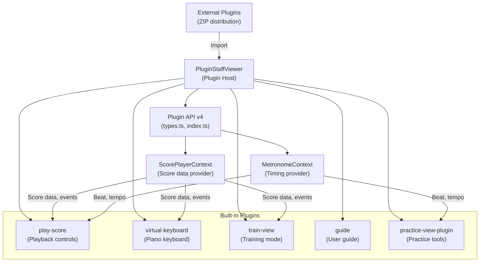

# Plugin System

## Overview

The Graditone Plugin System provides an extensible architecture for adding practice tools, custom views, and interactive features. Built on Plugin API v4, plugins register with the host application, receive score data and timing events, and render custom views alongside the staff notation. Plugins can be built-in (bundled with the app) or externally distributed as importable ZIP packages.

## Architecture

## Modules

| Module | Description |
|--------|-------------|
| **PluginStaffViewer** | Host component — loads plugins, manages lifecycle, provides rendering container alongside staff notation |
| **Plugin API v4** | TypeScript interface contract — defines plugin registration, lifecycle hooks, and event types |
| **ScorePlayerContext** | Context provider — supplies current score data, playback position, and selection events to plugins |
| **MetronomeContext** | Context provider — supplies beat/tempo timing, metronome state to plugins |
| **play-score** | Built-in plugin — playback transport controls, play/pause/stop, tempo adjustment |
| **virtual-keyboard** | Built-in plugin — on-screen piano keyboard for note input and visualization |
| **train-view** | Built-in plugin — training mode with practice exercises and feedback |
| **guide** | Built-in plugin — interactive user guide and help overlay |
| **practice-view-plugin** | Built-in plugin — practice tools: loop regions, slow practice, section repeat |
| **Plugin Manager** | UI dialog for enabling/disabling plugins and importing external plugin ZIPs |

## Data Flow

**Host loads plugin** → Plugin calls `register()` via Plugin API → Host provides `ScorePlayerContext` (score data, events) and `MetronomeContext` (timing) → Plugin renders custom view in designated container → Plugin listens for score/playback events and updates its view → User interactions in plugin trigger API callbacks to host

**External plugin import**: User selects ZIP → Plugin Manager extracts and validates → Plugin registered with host → Available in plugin panel

## Key Files

| Module | Path |
|--------|------|
| Plugin API entry | `frontend/src/plugin-api/index.ts` |
| Plugin types | `frontend/src/plugin-api/types.ts` |
| Plugin host | `frontend/src/plugin-api/PluginStaffViewer.tsx` |
| ScorePlayerContext | `frontend/src/plugin-api/scorePlayerContext.ts` |
| MetronomeContext | `frontend/src/plugin-api/metronomeContext.ts` |
| Staff viewer utils | `frontend/src/plugin-api/staffViewerUtils.ts` |
| Plugin manager UI | `frontend/src/components/plugins/PluginManagerDialog.tsx` |
| Plugin view | `frontend/src/components/plugins/PluginView.tsx` |
| play-score plugin | `frontend/plugins/play-score/` |
| virtual-keyboard plugin | `frontend/plugins/virtual-keyboard/` |
| train-view plugin | `frontend/plugins/train-view/` |
| guide plugin | `frontend/plugins/guide/` |
| practice-view plugin | `frontend/plugins/practice-view-plugin/` |

## See Also

- [Architecture Overview](architecture.md)
- [Frontend PWA](frontend-pwa.md) — application shell hosting the plugin system
- [SVG Renderer](svg-renderer.md) — rendering pipeline that plugins interact with
