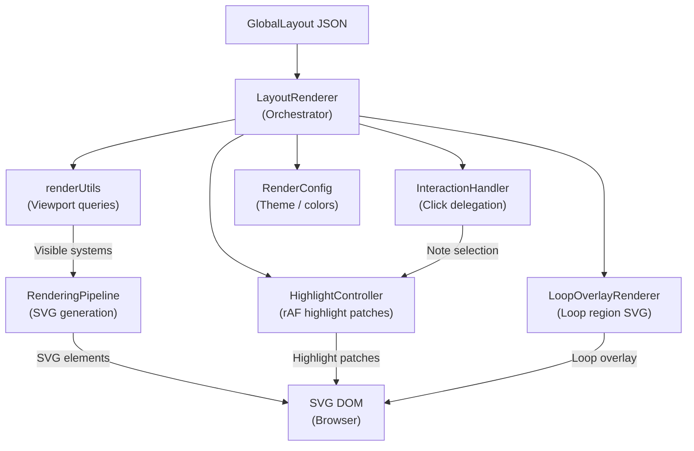

# SVG Renderer

## Overview

The SVG Renderer is a React/TypeScript module that transforms `GlobalLayout` JSON (produced by the Rust Layout Engine) into SVG DOM elements displayed in the browser. It uses a two-tier rendering model: a full SVG generation pass managed by `RenderingPipeline`, and an incremental highlight update pass managed by `HighlightController` using `requestAnimationFrame`. Viewport virtualization ensures only visible systems are rendered, maintaining 60fps scrolling performance even for long scores.

## Architecture

## Modules

| Module | Description |
|--------|-------------|
| **LayoutRenderer** | Main orchestrator — receives GlobalLayout, manages viewport scroll/zoom, delegates to pipeline and controllers |
| **RenderingPipeline** | Generates full SVG DOM from visible systems — staff lines, noteheads, clefs, barlines, beams, ties, slurs |
| **HighlightController** | Incremental highlight updates via `requestAnimationFrame` — avoids full re-renders for playback cursor and note selection |
| **InteractionHandler** | Click/tap event delegation — maps screen coordinates to glyph hit targets, triggers note selection and seek |
| **LoopOverlayRenderer** | Renders loop region visualization — green overlay between pinned notes for practice loops |
| **renderUtils** | Viewport query utilities — binary search for visible systems (<1ms), coordinate transforms, SVG helpers |
| **RenderConfig** | Theme configuration — colors, stroke widths, dark mode support, customizable via context |

## Data Flow

`GlobalLayout JSON` → **LayoutRenderer** receives layout → **renderUtils** queries viewport to find visible systems (binary search, <1ms) → **RenderingPipeline** generates SVG for visible systems only (~350 DOM nodes per viewport) → **HighlightController** patches highlights incrementally via rAF → **InteractionHandler** delegates clicks to glyph hit testing → **LoopOverlayRenderer** renders loop region overlay → Browser renders SVG DOM

**Performance**: <16ms frame time for 100-measure scores (40 systems), DOM virtualization limits nodes to ~350 per viewport

## Key Files

| Module | Path |
|--------|------|
| LayoutRenderer | `frontend/src/components/LayoutRenderer.tsx` |
| RenderingPipeline | `frontend/src/components/renderer/RenderingPipeline.ts` |
| HighlightController | `frontend/src/components/renderer/HighlightController.ts` |
| InteractionHandler | `frontend/src/components/renderer/InteractionHandler.ts` |
| LoopOverlayRenderer | `frontend/src/components/renderer/LoopOverlayRenderer.ts` |
| renderUtils | `frontend/src/utils/renderUtils.ts` |
| layoutUtils | `frontend/src/utils/layoutUtils.ts` |
| ScoreViewer page | `frontend/src/pages/ScoreViewer.tsx` |

## See Also

- [Architecture Overview](architecture.md)
- [Layout Engine](layout-engine.md) — produces the GlobalLayout JSON consumed by this renderer
- [Frontend PWA](frontend-pwa.md) — application shell and service architecture
- [Plugin System](plugin-system.md) — plugins interact with the renderer via Plugin API events
