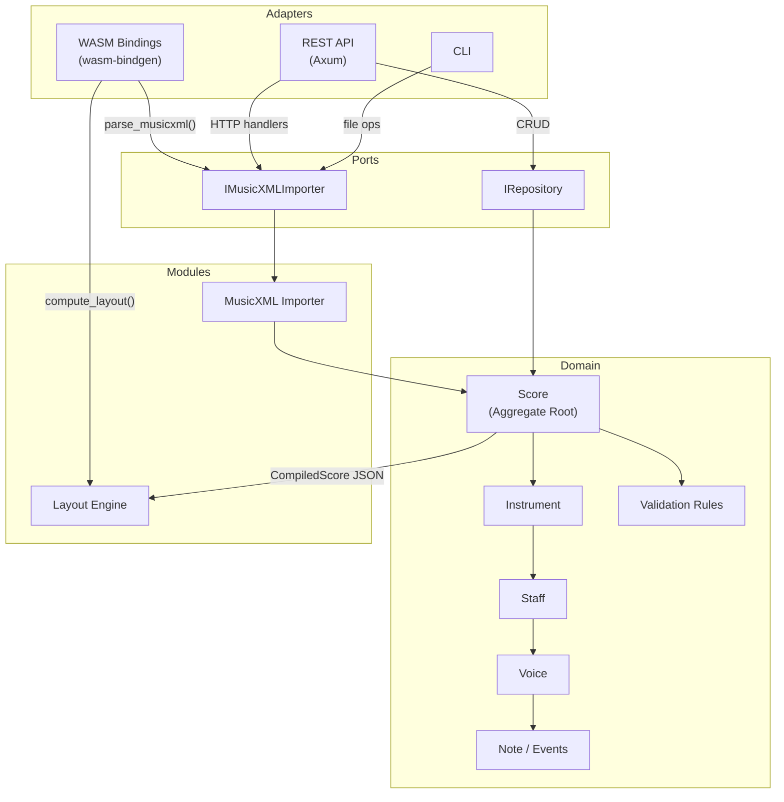

# Rust/WASM Engine

## Overview

The Rust/WASM Engine is the core backend of Graditone, implementing the music domain model using Domain-Driven Design principles within a hexagonal architecture. It compiles to WebAssembly for browser deployment and also provides a REST API (Axum) and CLI adapter for server-side use. The engine owns all domain logic — score structure, MusicXML import, layout computation, and validation — with the frontend consuming its outputs via WASM bindings.

## Architecture

## Modules

| Module | Description |
|--------|-------------|
| **Score** | DDD aggregate root — controls all mutations, enforces invariants |
| **Instrument** | Entity with identity (UUID) — contains one or more Staves |
| **Staff** | Entity — contains Voices, scoped structural events (Clef, KeySignature) |
| **Voice** | Entity — contains Notes with overlap validation |
| **Note/Events** | Value objects — Tick, BPM, Pitch, TempoEvent, TimeSignatureEvent, ClefEvent, KeySignatureEvent |
| **Validation** | Domain rules — overlap prevention, required defaults, structural consistency |
| **MusicXML Importer** | Port implementation — three-layer parser/converter/mapper pipeline (see [detail page](musicxml-importer.md)) |
| **Layout Engine** | Computes spatial geometry — system breaking, spacing, positioning (see [detail page](layout-engine.md)) |
| **WASM Bindings** | `wasm-bindgen` adapter — exposes `parse_musicxml()` and `compute_layout()` to JavaScript |
| **REST API** | Axum adapter — 13 endpoints for score CRUD, import, and query |

## Data Flow

**External input** → Adapter (WASM / REST / CLI) → Port interface → Domain logic (Score aggregate) → Port interface → Adapter → External output

**WASM deployment**: `wasm-pack build --target web` → generates `.wasm` + JS glue → frontend loads via dynamic import → calls `parse_musicxml()` and `compute_layout()`

**Domain model hierarchy**: `Score` → `Instrument[]` → `Staff[]` → `Voice[]` → `Note[]`, with global events (Tempo, TimeSignature) and staff-scoped events (Clef, KeySignature)

## Key Files

| Module | Path |
|--------|------|
| Library entry | `backend/src/lib.rs` |
| Domain model | `backend/src/domain/` |
| Score aggregate | `backend/src/domain/score.rs` |
| Instruments/Staff/Voice | `backend/src/domain/instrument.rs`, `staff.rs`, `voice.rs` |
| Value objects | `backend/src/domain/value_objects.rs` |
| Ports | `backend/src/ports/` |
| REST adapter | `backend/src/adapters/api/` |
| WASM adapter | `backend/src/adapters/wasm/` |
| WASM bindings | `backend/src/layout/wasm.rs` |
| Layout engine | `backend/src/layout/` |
| MusicXML importer | `backend/src/domain/importers/musicxml/` |

## See Also

- [Architecture Overview](architecture.md)
- [Layout Engine](layout-engine.md) — layout pipeline details
- [MusicXML Importer](musicxml-importer.md) — import pipeline details
- [Frontend PWA](frontend-pwa.md) — WASM integration on the frontend
