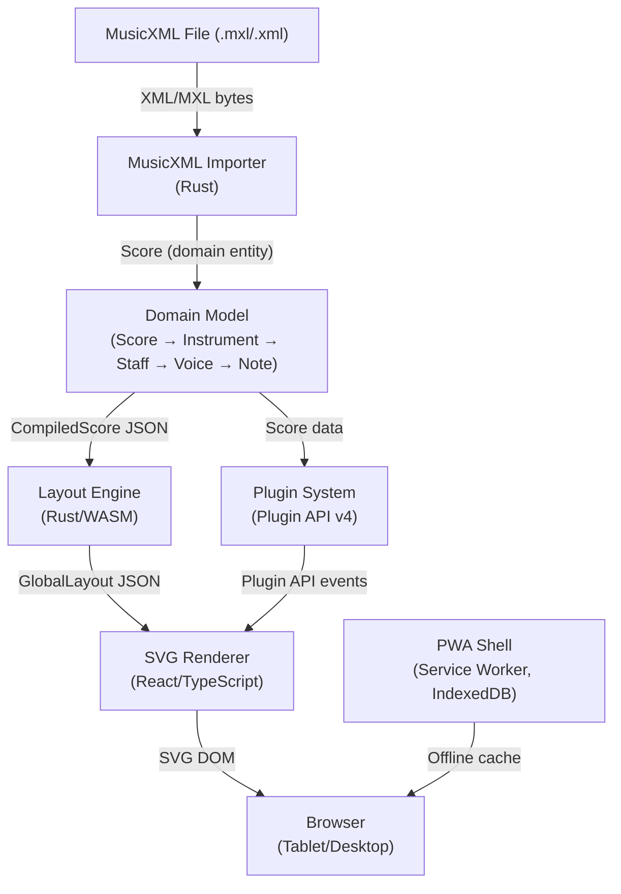

# Contract: Architecture Overview Page

**File**: `docs/architecture.md`  
**Type**: Overview page  
**Feature**: 059-doc-architecture

---

## Required Sections

1. **Title**: "Graditone Architecture"
2. **Overview paragraph**: One paragraph describing the system at high level
3. **High-level Mermaid diagram**: Shows all major subsystems and data flow between them
4. **Component descriptions**: Brief paragraph for each subsystem with link to detail page
5. **Links section**: Links to all subsystem pages + LOCAL-VALIDATION.md + doc-update-checklist.md

## Mermaid Diagram Specification

## Node Descriptions (to include as text below diagram)

| Component | Description | Detail Page |
|-----------|-------------|-------------|
| MusicXML Importer | Parses .mxl/.xml files into domain Score entities | `docs/musicxml-importer.md` |
| Domain Model | DDD aggregate root (Score) with hierarchical entities | `docs/wasm-engine.md` |
| Layout Engine | Computes all spatial geometry (positions, spacing, bounding boxes) | `docs/layout-engine.md` |
| SVG Renderer | Renders layout JSON to SVG DOM with virtualization | `docs/svg-renderer.md` |
| Plugin System | Extensible plugin architecture with Plugin API v4 | `docs/plugin-system.md` |
| PWA Shell | Service Worker, IndexedDB, offline-first infrastructure | `docs/frontend-pwa.md` |

## Link Requirements

- Every subsystem in the diagram MUST have a corresponding link to its detail page
- `docs/LOCAL-VALIDATION.md` MUST be linked under a "Related" or "See Also" section
- `docs/doc-update-checklist.md` MUST be linked for contributors
